## DSEH
[Deep Joint Semantic-Embedding Hashing](https://www.ijcai.org/proceedings/2018/0332.pdf)

## Abstract
Hashing has been widely deployed to large-scale image retrieval due to its low storage cost and fast query speed. Almost all deep hashing methods do not sufficiently discover semantic correlation from label information, which results in the learned hash codes less discriminative. In this paper, we propose a novel **D**eep Joint **S**emantic-**E**mbedding **H**ashing (***DSEH***) approach that consists of *LabNet* and *ImgNet*. Specifically, *LabNet* is explored to capture abundant semantic correlation between sample pairs and supervise *ImgNet* from both semantic level and hash codes level, which is conductive to the generated hash codes being more discriminative and similarity-preserving. Extensive experiments on three benchmark datasets show that the proposed model outperforms current state-of-the-art methods.

## Framework
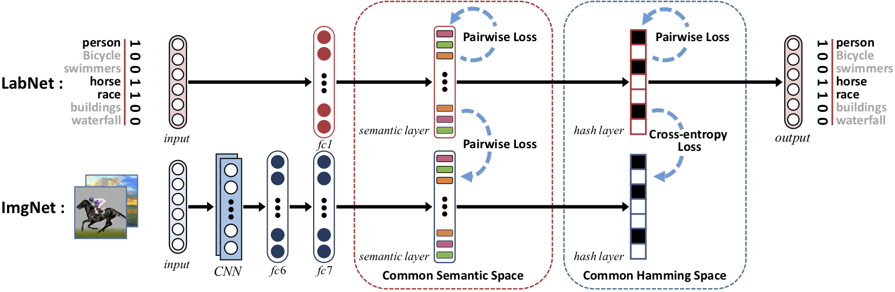

## Result
>MAP

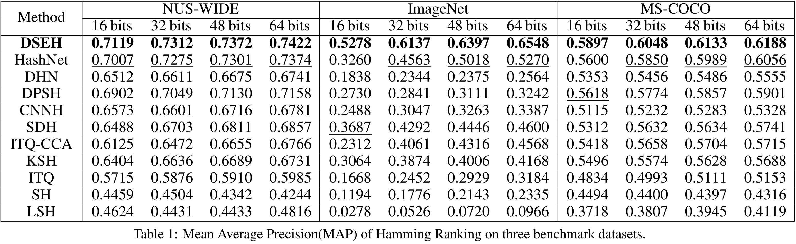
>PR curve

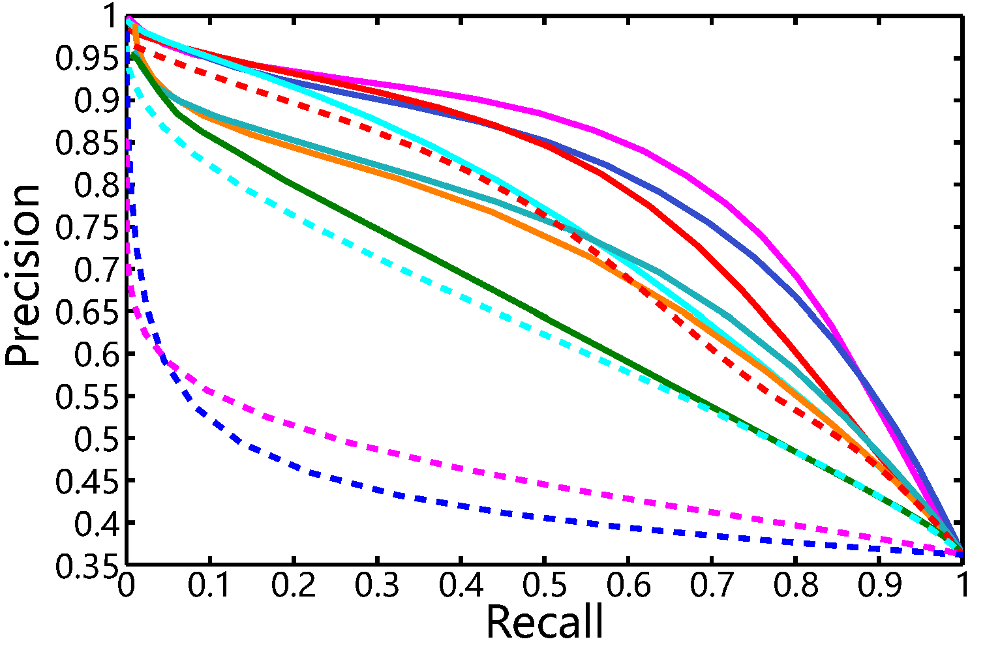 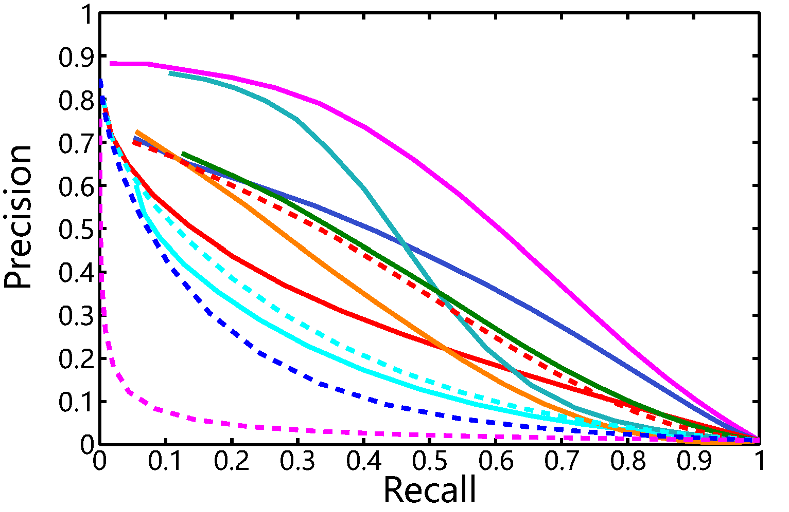 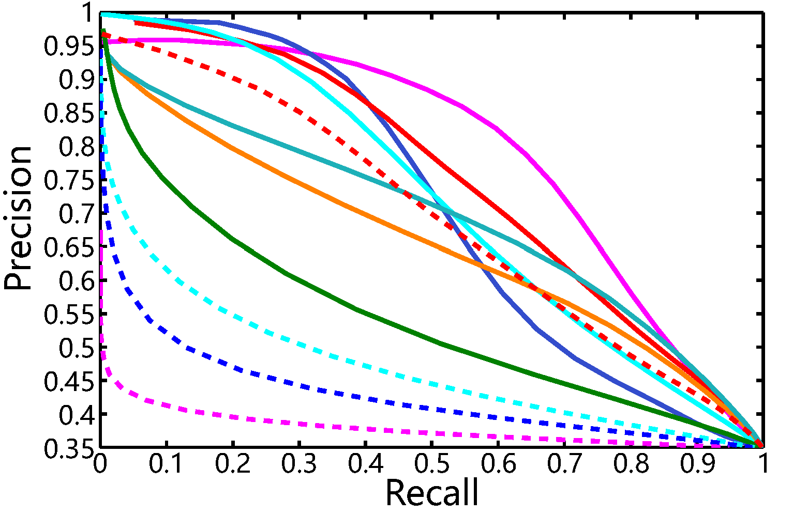 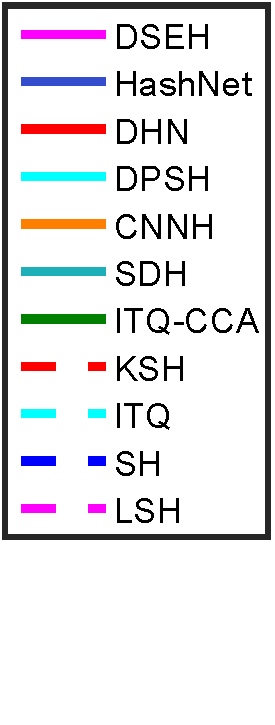 

>Top 1000 curve

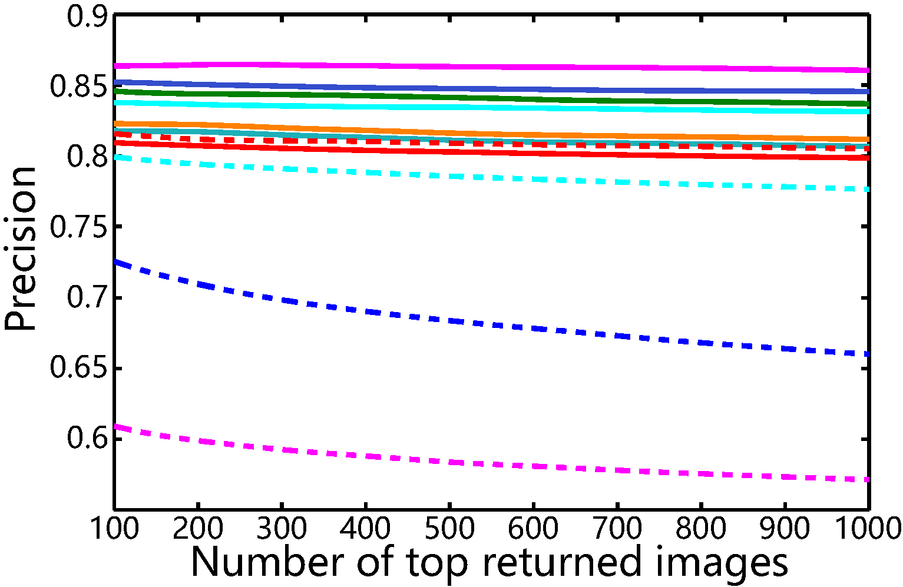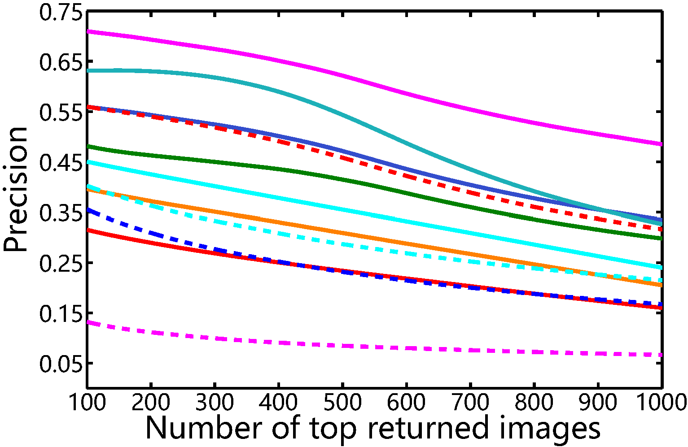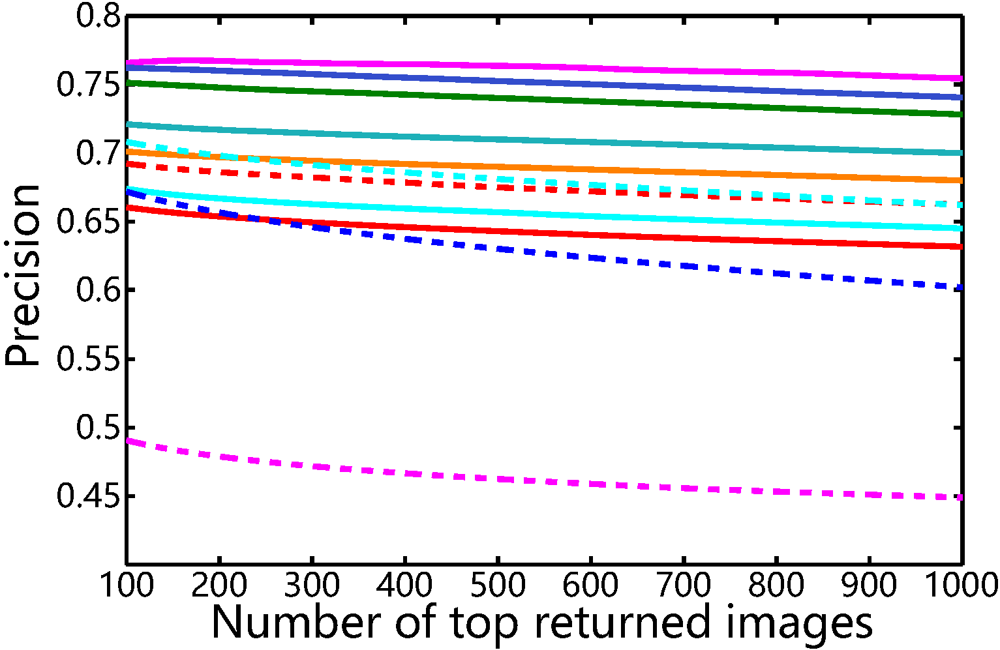

>Visualization of Semantic Features of *LabNet* and *ImgNet*

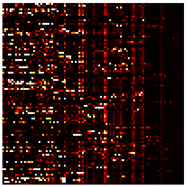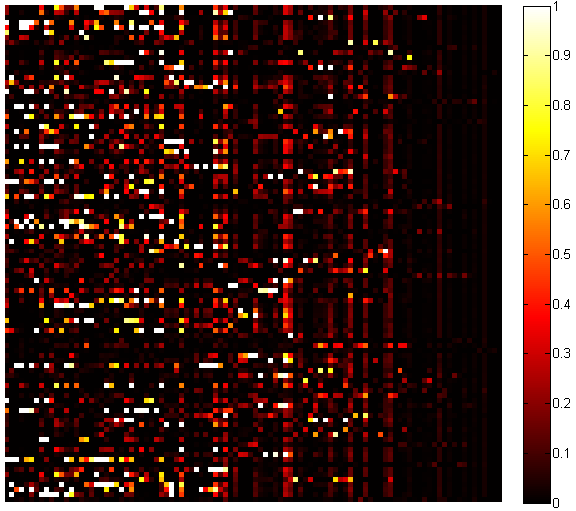

## Citing DSEH
If you find DSEH useful in your research, please consider citing:
```
@inproceedings{li2018deep,
  title={Deep Joint Semantic-Embedding Hashing.},
  author={Li, Ning and Li, Chao and Deng, Cheng and Liu, Xianglong and Gao, Xinbo},
  booktitle={IJCAI},
  pages={2397--2403},
  year={2018}
}
@inproceedings{li2018self,
  title={Self-Supervised Adversarial Hashing Networks for Cross-Modal Retrieval},
  author={Li, Chao and Deng, Cheng and Li, Ning and Liu, Wei and Gao, Xinbo and Tao, Dacheng},
  booktitle={Proceedings of the IEEE Conference on Computer Vision and Pattern Recognition},
  pages={4242--4251},
  year={2018}
}
```
